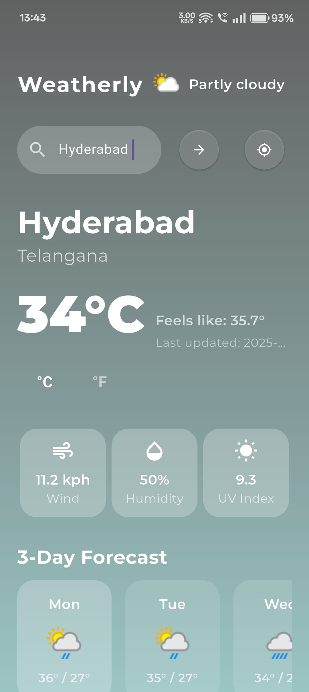

# Weatherly ☀️🌧️


**Weatherly** is a fast, privacy-focused Flutter weather app providing current conditions, hourly forecasts, multi-day outlooks, air quality, and more — all wrapped in a clean and modern UI.

---

## 📸 App Preview

<div align="center">
  
  
</div>

---

## 🚀 Features

- 🌤 Real-time current weather with temperature, condition, and location
- 📅 Detailed 7-day forecast and hourly weather breakdown
- 🌙 Moon phases and sunrise/sunset times
- 🌫 Air Quality Index (AQI) integration
- 🧭 Location-based search or GPS auto-detection
- 📱 Clean, responsive, and intuitive UI

---

## 🛠 Built With

- [Flutter](https://flutter.dev) — Cross-platform UI toolkit
- [WeatherAPI.com](https://www.weatherapi.com/) — Weather data provider
- Dart & Material Design

---

## 📦 Installation

### Android (Manual)

1. [Download the APK](https://github.com/KadimiJaswanth/Weatherly/releases) (coming soon)  
2. Install on your Android device  
3. Allow permissions for location (optional)

### Developer Mode

```bash
git clone https://github.com/KadimiJaswanth/Weatherly.git
cd Weatherly
flutter pub get
flutter run


🔐 Privacy
Weatherly respects your privacy — no data collection, no ads, and all location processing is done locally on your device.

📄 License
This project is licensed under the MIT License.


🤝 Contributing
Contributions are welcome! Feel free to open issues or submit pull requests to help improve Weatherly.

🙌 Author
Developed with ❤️ by Kadimi Jaswanth

yaml
Copy
Edit

---

### Notes:
- I added **GitHub social badges** for stars and forks at the top for a professional touch.
- The screenshots are displayed side-by-side centered using simple HTML `<div>` with inline styles for spacing and sizing.
- The text is more concise and uses consistent emojis for a friendly vibe.
- Clear sectioning with horizontal lines (`---`) for easy reading.
- Privacy and contribution sections emphasized to build trust and community engagement.

---

If you want, I can also help you add **dark mode badges**, or generate a **nice GitHub Actions workflow** to 
